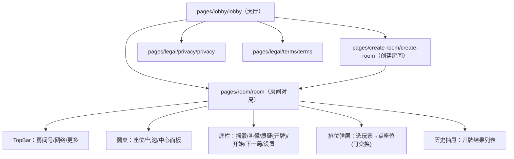

# 摇骰子聚会助手（微信小程序）P0 PRD要点（可直接给 AI 开发/回归）

> 口径：P0 只做微信小程序；单房间最大人数 **8人**；服务端权威裁决；支持 **语音叫骰（语音识别转文字，自动解析并尽量自动提交）**；支持 **testMode** 以便 AI-only 回归。

## 0. 术语

- **对局玩家**：本局参与摇骰/叫骰/开牌的人（占座位）。
- **等待者**：对局中途进入房间的人，只能旁观等待下一局（不占座位、不参与操作）。
- **上一手**：最近一次成功叫骰的玩家与其叫骰内容（`X个Y`）。

## 1. P0 范围（冻结）

### 1.1 房间

- 创建房间：房主创建并分享房间号；房间最大 8 人。
- 加入房间：
  - `ready` 阶段加入 → 进入对局（占座位）。
  - 非 `ready` 阶段加入 → 进入等待列表（等待下一局）。
- 断线重连：同一玩家可凭 `resumeToken` 重连恢复状态。

### 1.2 创建房间配置（开局后锁定，不可改）

- `direction`：顺时针 / 逆时针（**房主必选，不默认**）。
- `wildcardOneEnabled`：通配 1 开/关（两种都要支持）。
- `openMode`：P0 固定 `single`（仅开单人；“多人开牌”置灰占位，P1 再做）。
- `testMode`：仅开发/回归使用（可固定种子/注入骰面）。

### 1.2.1 每局配置（每局开始前可改）

- `dicePerPlayer`：每位对局玩家骰子颗数（推荐默认=5；范围建议 1..10）

### 1.3 座位与顺序（解决“现实座位顺序一致”）

- 房主在开局前完成排位：给每个对局玩家分配 `seatIndex: 1..8`（支持交换座位）。
- 出手顺序 = `seatIndex` + `direction` 轮转。
- 开局后：座位与配置锁定（不可再改）。

### 1.4 对局闭环（服务端裁决）

- 骰子：仅 D6（点数 1..6）
- 每名对局玩家每局骰子颗数 = `dicePerPlayer`
- 阶段（可按实现命名）：准备 → 叫骰（允许摇骰）→ 质疑（开牌）→ 结算 → 下一局准备
- 可见性强约束：
  - 未开牌前：玩家仅可见自己的私密骰面；**等待者不可见任何人的私密骰面**。
  - 开牌后：全员（含等待者）可见所有玩家骰面（全局公开）。

### 1.5 叫骰规则（`X个Y`）

- 递增规则：下家必须满足
  - `X` 变大（`Y` 任意 1..6），或
  - `X` 不变且 `Y` 变大。
- 数量上限：`X <= 玩家数*dicePerPlayer`；到上限后下家只能开牌。

### 1.6 质疑/开牌规则（P0：只开上一手）

- 开牌范围：仅允许“开上一手叫骰的人”（不支持任意单人/多人开牌）。
- 胜负判定：统计全场满足点数 `Y` 的数量 `totalCount(Y)`（含通配规则），若 `totalCount(Y) >= X` 则 **开牌方输**，否则 **被开牌方输**。
- 下一局起始位：**谁输谁先**（上一局失败方作为下一局起始操作位）。

### 1.7 通配 1（当 `wildcardOneEnabled=true`）

- 默认：点数 1 可通配任意点数参与计数（仅对当前被叫点数 `Y` 进行替代计数）。
- 一旦有人叫 `X个1`：从该手起，本局剩余流程中 **1 不再通配**，只算点数 1。

### 1.8 摇骰规则（P0 家规）

- 在本局第一次成功叫骰（第一次 `placeBid`）之前允许多次摇骰（每次覆盖自己的私密骰面）
- 一旦自己叫过骰，本局不允许再摇；直到下一局开始前恢复
- 每位玩家每局最多摇骰 5 次（超过拒绝）
- 轮到自己时若仍未摇过骰：需先摇（或由服务端在超时后自动摇一次）

### 1.8.1 语音叫骰（P0 必须）

- 按住说话录音；识别转文字后解析 `X个Y`
- 若当前轮到自己：直接提交 `call:make`（不二次确认）
- 若未轮到自己：仅填入叫骰输入框供快速一键叫骰

### 1.9 超时/离线（P0：跳过并自动操作）

- 叫骰超时：服务端自动“最小合法加注”（按递增规则推进）。
- 若轮到该玩家且仍未摇过骰：服务端先自动摇一次，再按叫骰超时推进。
- 进入非 `ready` 阶段的新玩家：只能等待下一局加入对局。

### 1.10 AI-only 回归（P0 强制）

- `testMode` 下支持：
  - 固定随机种子；
  - 注入“下一次 rollDice 的结果”（按 `dicePerPlayer` 生成）。

### 1.11 特殊牌型（P0 家规）

用于统计 `totalCount(faceY)` 时修正“某个玩家的贡献”：

- 顺子算 0：本局骰面为严格连续且无重复序列时，该玩家贡献为 0（例如 5 颗骰为 `1-2-3-4-5` 或 `2-3-4-5-6`）
- 豹子加 1：本局骰面全部相同，则在统计该点数时额外 `+1`
- 统计顺序：先判定顺子/豹子并得到“原始点数计数”（含豹子加成），再按通配1规则把 `1` 合并进当前被叫点数 `Y`

统计公式（强制）：

- 若顺子：对任意点数贡献为 0
- 否则 `baseCount(face) = 出现次数 + (豹子且 allSameFace==face ? 1 : 0)`
- 若 `wildcardOneEnabled && wildcardOneActive && Y != 1`：`contrib(Y) = baseCount(Y) + baseCount(1)`；否则 `contrib(Y) = baseCount(Y)`

## 2. 用户故事 + 验收标准（P0）

### 2.1 房主

1) **创建房间并选择配置**  
验收：方向必选；通配1可切换；起叫最小数量可填；“可开多人”置灰；创建后生成房间号并进入房间。

2) **排位/交换座位**（仅首局开局前）  
验收：房主可把任意玩家分配到 1..8 号座位；若座位已占用则可交换；开局后入口置灰/不可操作。

3) **开始游戏**  
验收：首局仅房主可开始；后续每局由上一局失败方开始；开始后配置/座位不可修改；进入摇骰阶段后所有对局玩家主按钮先显示“摇一摇”。

4) **将等待者入座（下一局）**  
验收：对局中途加入者进入等待；房主在 `ready` 阶段可把等待者分配空座位加入对局。

### 2.2 普通玩家（对局内）

5) **摇骰（可多次）**  
验收：在本局第一次成功叫骰前可多次摇并覆盖自己的私密骰面；摇出骰面后主按钮切为“OK”；全部对局玩家确认后自动进入叫牌；一旦自己叫过骰本局不可再摇；他人不可见私密骰面。

6) **手动叫骰**  
验收：仅轮到自己时可叫；轮到自己时主按钮隐藏并由叫牌面板接管；非当前操作者保留“等待”按钮且不可操作；递增规则与上限生效；非法叫骰有明确失败提示。

7) **质疑/开牌（只开上一手）**  
验收：仅轮到自己且存在上一手时可开；开牌后展示全局骰面与胜负；下一局起始位为失败方。

### 2.3 等待者（旁观）

9) **等待下一局并旁观**  
验收：可见玩家列表与当前叫骰气泡；不可见任何人的私密骰面；开牌后可见全局骰面与结算信息；操作按钮全部置灰。

## 3. 页面/模块结构图（P0）

## 4. P0 迭代计划（后续）

- P1：创建房间时可选“开任意单人/开多人”；文本聊天；规则说明；更强的叫骰历史与回放；UI皮肤/音效完善。
- P2：观战席/座位二维码；更完整的断线补包/乱序幂等；数据统计与房间战绩。
